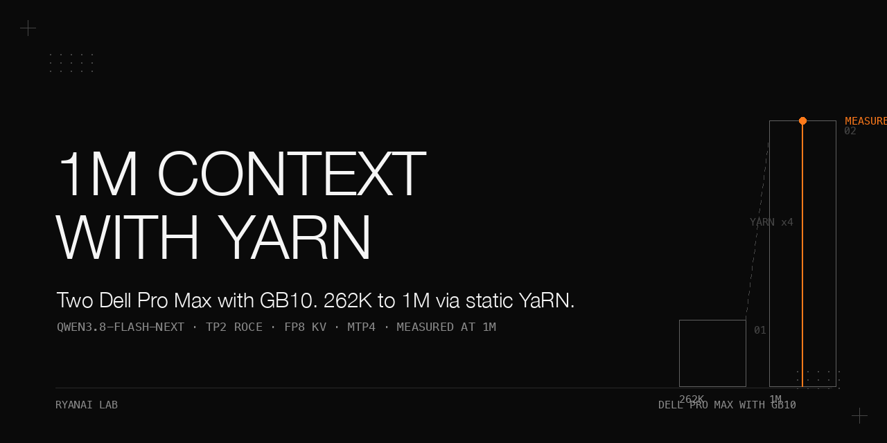

# Qwen3.8-Flash-Next at 1M context on two Dell Pro Max with GB10 — static YaRN, measured

> We extend Qwen3.8-Flash-Next (abbreviated NF) from its native 262K context to a 1,000,000-token window using static YaRN rope scaling at factor 4, deployed across two Dell Pro Max with GB10 nodes running a community cluster recipe (TP2 over RoCE, fp8 KV cache, MTP4 speculative decoding). The 1M window validates cleanly: the engine reports 3,441,324–3,482,606 KV tokens (~3.44× one 1M-token request, so a 1M request occupies ~29% of the pool), needle content recall is 27/27 at 400K / 700K / 950K depths, cold prefill is stable across three repeats, and in the non-thinking validation run, c1/c4 showed no regression against the 262K reference run (c1 96.7/96.7, c4 95.8/95.8); in the thinking-mode engine-form A/B, native 262K scored 5.0 points higher on c1 than the 1M YaRN build. Two bugs surfaced and were fixed along the way — a draft-path `max_model_len` cap at 262144, and an async-scheduling × MTP race that caused runaway loops on agent tasks (fixed with the single flag `--no-async-scheduling`, which the recipe table already lists). The model's agentic category needs thinking mode; that investigation lives in a sibling cookbook. A native-262K-vs-1M comparison recommends native 262K as the default production tier with 1M YaRN available on demand (switch time ≈4 minutes via the switch script).

## Why this matters

A 1M-token window on commodity dual-node hardware is only useful if it does not cost you quality on the short prompts that make up most real traffic. The two failure modes here are instructive precisely because neither is obvious: one crashes any request past 262K with a stack trace, and the other *silently* inflates agent wall clock 2.6× and 4.1× (c3-tool and c7-agentic-if) while still returning correct answers — so a naive "the answers look fine" acceptance would ship a model that loops. This cookbook is the measured record of the 1M recipe and its validation: what works, what silently does not, and the single flags that separate the two.

## Hardware and stack

| Component | Value |
|---|---|
| Hardware | Two Dell Pro Max with GB10 (head node + worker node) |
| Parallelism | TP2 over RoCE (200GbE QSFP direct link) |
| Cluster recipe | `qwen3.8-flash-next-nvfp4-cluster` (image `vllm-node-b12x`) |
| KV cache precision | fp8 |
| Speculative decoding | MTP4 (`num_speculative_tokens: 4`) |
| GPU memory utilisation | 0.70 (`--gpu-memory-utilization 0.70`) |
| Rope scaling | `text_config.rope_parameters` via `--hf-overrides`: YaRN factor 4, preserving mrope fields |
| Allow long model len | `VLLM_ALLOW_LONG_MAX_MODEL_LEN=1` (env var) |
| Max model length | `--max-model-len 1000000` |
| MTP draft length fix | `--speculative-config '{"method":"mtp","num_speculative_tokens":4,"max_model_len":1000000}'` |
| Async scheduling | `--no-async-scheduling` (added after the runaway-loop finding; see Pitfalls) |
| Tool-call parser | `--tool-call-parser qwen3_coder` |
| Reasoning parser | `--reasoning-parser qwen3` |
| API endpoint | port `:8899` (alias for NF) |

### Versions and images

| Item | Value |
|---|---|
| Engine image | `vllm-node-b12x` (digest prefix `d6fb7a6a277d`) |
| vLLM build string | `v0.1.dev20759+gb40673cd0` |
| Cluster recipe | `qwen3.8-flash-next-nvfp4-cluster` in [github.com/eugr/spark-vllm-docker](https://github.com/eugr/spark-vllm-docker) |
| Host driver | 580.178.04 |
| Kernel | 7.0.0-1019 (after the September OTA) |
| Weights | [local-inference-lab/Qwen3.8-Flash-Next-NVFP4](https://huggingface.co/local-inference-lab/Qwen3.8-Flash-Next-NVFP4) on Hugging Face (revision not recorded) |
| Interconnect | RoCE, 200GbE QSFP direct link |

The model's default inference configuration is thinking mode, per the official model card (revision not recorded; the card's default thinking setting is a referenced recommendation, not a value we measured here). Where a step depends on a community recipe or an internal script we do not redistribute, that is called out explicitly.

Full `--hf-overrides` JSON used for the 1M window:

```json
{"text_config": {"rope_parameters": {"mrope_interleaved": true, "mrope_section": [11, 11, 10], "rope_type": "yarn", "rope_theta": 10000000, "partial_rotary_factor": 0.25, "factor": 4.0, "original_max_position_embeddings": 262144}}}
```

## How to reproduce

1. **Deploy the cluster.** Start the two-node TP2 cluster using the `qwen3.8-flash-next-nvfp4-cluster` recipe in the community repo [github.com/eugr/spark-vllm-docker](https://github.com/eugr/spark-vllm-docker) (image `vllm-node-b12x`, digest prefix `d6fb7a6a277d`, vLLM build `v0.1.dev20759+gb40673cd0`) with fp8 KV cache, MTP4, and `--gpu-memory-utilization 0.70`. The head node serves on `<HEAD_IP>:8899`; the worker node joins over RoCE at `<WORKER_IP>`. We do not redistribute the image; fetch it from the community repo.
2. **Apply the long-len overrides.** Set `VLLM_ALLOW_LONG_MAX_MODEL_LEN=1` and pass `--max-model-len 1000000`.
3. **Inject YaRN via hf-overrides.** Embed the `text_config.rope_parameters` block above (YaRN factor 4, preserving all mrope sub-fields) in the `--hf-overrides` dict.
4. **Fix the MTP draft length cap.** Pass `--speculative-config` with `"max_model_len": 1000000` explicitly, otherwise the draft model silently stays at 262144 (see Pitfalls).
5. **Disable async scheduling.** Add `--no-async-scheduling`. This vLLM build auto-enables async when MTP is active, triggering a host/device race that causes runaway agent loops (see Pitfalls).
6. **Set parsers.** Configure `--tool-call-parser qwen3_coder` and `--reasoning-parser qwen3`.
7. **Validate the window.** Run `scripts/needle_probe.py` at 400K / 700K / 950K depths and the cold/hit prefill timing. (The 27-sample matrix — three depths × nine needles against the private corpus — and the K1 throughput numbers are reported only; see [`docs/results.md`](docs/results.md).) Example probe:

   ```
   python3 scripts/needle_probe.py http://<HEAD_IP>:8899/v1 <MODEL> 950000 --depth 0.37 --lang zh
   # prints: prompt=<N> tok | wall=<s>s | hit=yes|no
   ```

The switch between the 1M YaRN tier and the native 262K tier is done via the switch script; an engine restart takes ≈4 minutes (author-reported, from the private switch script; start/stop boundary not defined here).

## Results

All quality scores are from a private 11-category eval bank whose questions are not published; those scores are reported, not reproducible by readers. The engine-level measurements that readers can reproduce with the published flags and `scripts/needle_probe.py` are a single-depth needle probe and the cold/hit prefill timing; the 27-sample matrix (three depths × nine needles, private corpus) is reported only. Full tables with condition lines are in [`docs/results.md`](docs/results.md).

### 1M context validation (non-thinking mode)

Conditions: `qwen3.8-flash-next-nvfp4-cluster` (image `vllm-node-b12x`), TP2 RoCE, fp8 KV, MTP4, gmu 0.70, YaRN factor 4, `--max-model-len 1000000`.

| Metric | Value | Condition |
|---|---|---|
| KV pool tokens | 3,441,324–3,482,606 | ~3.44× one 1M-token request; a 1M request occupies ~29% of the pool; range across starts |
| c1-kbqa short-text | 96.7 / 96.7 | two runs; no regression vs 262K baseline |
| c4-code short-text | 95.8 / 95.8 | two runs |
| c2-longctx (30 items incl. 200K) | 100 / 96.7 | two runs; exceeds 262K baseline |
| Needle content recall, 400K / 700K / 950K | 9/9 / 9/9 / 9/9 | content-level recall (not strict) |
| Cold prefill 400K / 700K / 950K (corpus) | ≈3 min / ≈6.3 min / ≈10 min | single run each |
| Cold prefill 950K (random words) | 857 s ≈ 1.1K tok/s | single run |
| 950K cold ×3 | 856 / 860 / 859 s, all correct | hit=7.9 s consistent; zero crashes |
| 3-way 900K concurrent | 793 / 1583 / 2373 s, all correct | queued serial, zero crashes |
| K1 decode | 52.0–52.9 tok/s | single-stream decode on a 400-token prose completion; parity with 262K baseline |
| K1 prefill | 3034 tok/s | cold prefill on a ~2.3K-token prompt; parity with 262K baseline |
| K1 6-stream | 88–89 tok/s | six concurrent streams aggregate; parity with 262K baseline |
| Health (both nodes) | NVRM/Xid 0; zero engine errors; no restarts | author-reported (private switch script); observation interval and restart/counter collection method not defined here |

### Native 262K vs 1M YaRN factor 4 (single model)

Conditions: thinking on + official thinking sampling + `qwen3_coder` + YaRN factor 4; base = 1M YaRN factor 4, native = the same model at its native 262K context.

| Category | Base (1M YaRN×4) | Native 262K |
|---|---|---|
| c1-kbqa | 88.3 | 93.3 (+5.0) wall 0.98× |
| c5-extract | 84.2 | 86.0 (+1.8) wall 1.31× |
| c7-agentic-if | 91.7 | 92.5 (+0.8) wall 1.02× |
| c8-judgment | 98.3 | 98.3 (+0.0) wall 1.05× |
| c9-long-coding | 100.0 | 100.0 (+0.0) wall 0.62× |

Native 262K matches or beats the 1M tier on the five categories we measured and is faster on c9-long-coding (native took 0.62× of the 1M YaRN wall clock, i.e. YaRN took ~1.6× native). The 1M tier's value is the window itself, not a short-text advantage — hence native 262K is the recommended default production tier with 1M YaRN available on demand.

## What did not work (negative results)

### MTP draft silently capped at 262144

**Symptom:** Engine starts, but any request with `max_model_len` > 262144 crashes with `QSA sequence length 1000000 exceeds the configured limit 262144` (stack trace in `mtp.py`). We found no report of this in the vLLM issue tracker as of 2026-09-19.

**Root cause:** This vLLM build constructs the draft `ModelConfig` with `max_model_len=speculative_config.max_model_len`. When `--hf-overrides` is a plain dict, it does not propagate to the draft; `max_model_len` defaults to `None`, so the draft inherits the model's original 262144 rope limit.

**Fix:** Pass `"max_model_len": 1000000` explicitly inside the `--speculative-config` JSON dict.

### Async-scheduling × MTP runaway loop

A runaway loop on agent tasks (single response >8000 tokens; c3-tool 122 s and c7-agentic-if 214 s with async on, versus 46 s and 52 s after `--no-async-scheduling` (2.6× and 4.1×); the DeepSeek baseline on the same day was 39 s and 42 s, with 3/120 runaway responses) was caused by a host/device race when this vLLM build auto-enables async scheduling alongside MTP. After `--no-async-scheduling`: 0/120 runaway responses. The full single-variable isolation table lives in [`dell-pro-max-gb10-vllm-mtp-async-runaway`](https://github.com/ryangu00/dell-pro-max-gb10-vllm-mtp-async-runaway).

### Static YaRN hurts short text

c1-kbqa drops 5 points under YaRN factor 4 (88.3 (1M YaRN×4) vs 93.3 (native 262K)), and c9-long-coding is ~1.6× wall clock under YaRN (native took 0.62× of the 1M run) — the official card's warning, confirmed on our eval bank. Use native 262K for short-text workloads; reserve 1M YaRN for runs that actually need the context.

### c7-agentic-if needs thinking mode

Even after the async fix, the model's agentic category scored below the gate in our non-thinking run — the three restraint-type questions that scored zero in every non-thinking run are a reasoning behaviour, not an engine bug (not ruled out by this repo alone), and close only under thinking mode. The gate threshold and the non-thinking summary are reported in a sibling cookbook; the local evidence here is insufficient to confirm the threshold. That investigation is in [`dell-pro-max-gb10-qwen3.8-flash-next-agentic-thinking`](https://github.com/ryangu00/dell-pro-max-gb10-qwen3.8-flash-next-agentic-thinking).

## Pitfalls

See [`docs/pitfalls.md`](docs/pitfalls.md) for symptom / root cause / fix / how-we-found-it. Summary:

- `QSA sequence length 1000000 exceeds the configured limit 262144` on any request >262K → MTP draft inherits `max_model_len=None` → set `"max_model_len": 1000000` explicitly inside `--speculative-config`.
- Runaway loops on agent tasks, async MTP on → the accepted-token bookkeeping between the host and device is the suspected mechanism (community issues #53912 and #51571 describe the same pattern); what we measured is the correlation: 3/120 with async on, 0/120 with it off → `--no-async-scheduling` (full table in the runaway cookbook).
- Short-text category (c1) drops 5 points after YaRN factor 4 → static YaRN hurts short text → use native 262K for short-text workloads; 1M YaRN only when context demands it.
- Container logs disappear after `docker rm -f <container>` → vLLM log lives inside the container → switch script runs `docker logs --tail 4000 <container> > <LOG_DIR>/lastlog-<container>.log` before removal.
- Our results-comparison script fails on the c2 subset after merging run directories → merged directory omitted `raw/` → include `raw/` when merging results directories.

## Related cookbooks

- [`dell-pro-max-gb10-vllm-mtp-async-runaway`](https://github.com/ryangu00/dell-pro-max-gb10-vllm-mtp-async-runaway) — the async-scheduling × MTP runaway loop and its single-variable isolation table.
- [`dell-pro-max-gb10-qwen3.8-flash-next-agentic-thinking`](https://github.com/ryangu00/dell-pro-max-gb10-qwen3.8-flash-next-agentic-thinking) — the c7-agentic-if thinking-mode investigation, prompt/sampling/framework attempts, the effort ladder, and the full 11-category v3 tables.
- [`dell-pro-max-gb10-qwen3.8-flash-next-engine-ab`](https://github.com/ryangu00/dell-pro-max-gb10-qwen3.8-flash-next-engine-ab) — the full engine-form A/B tables, including KV bf16, indexer, and MTP-off rows.

## Files

- `README.md` — this document.
- `docs/results.md` — the 1M validation table and the native-vs-1M delta table, each with its measurement conditions.
- `docs/pitfalls.md` — the pitfalls expanded: symptom / root cause / fix / how we found it.
- `scripts/needle_probe.py` — the needle-in-a-haystack probe (stdlib only); run it to reproduce the needle recall numbers.
- `docs/make_banner.py` — the banner generator (pure PIL). Pillow is required: `python3 -m pip install pillow`; the script uses macOS system fonts and falls back to PIL's default font elsewhere (layout then differs).

The raw eval bank logs, question texts, per-item scoring detail, run directory names/hashes, and switch-script internals are private and are not included in this cookbook.

## License

Apache-2.0.
